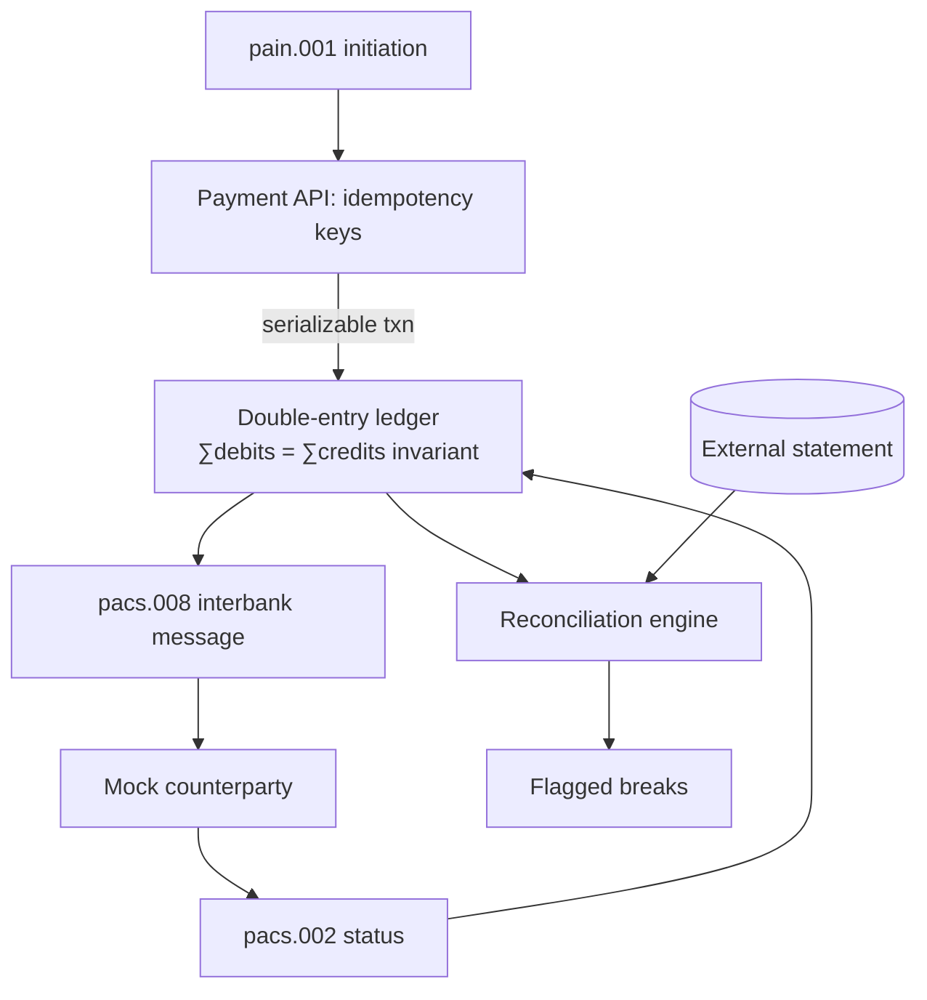

# Payments & Ledger Engine

> A correct, idempotent, concurrency-safe **double-entry ledger** with **ISO 20022** payment processing and a reconciliation engine.

**Skill signal:** Payments · data modelling · correctness & concurrency · systems engineering
**Region anchor:** EU (SEPA Instant) · UK (Faster Payments) · US (FedNow) — all ISO 20022

---

## Why this exists

Moving money is the one place fintech cannot be "mostly right." A payment system must never double-spend, never drift, and must behave correctly when the same request arrives twice or two requests arrive at once. This project builds the core of that: an immutable double-entry ledger, idempotent payment initiation, ISO 20022 message processing, and reconciliation against an external statement.

## Architecture

## Stack

- **Go** — strong concurrency story, dominant in payments infrastructure
- **PostgreSQL** — ledger storage with serializable transactions
- **ISO 20022** XML message processing (pain.001 → pacs.008 → pacs.002)
- **Docker Compose**

## What makes it stand out

- **Provable correctness** — the ∑debits = ∑credits invariant is enforced in code and asserted in tests; the ledger is append-only.
- **Exactly-once under pressure** — idempotency keys + serializable/optimistic locking.
- **Failure demo:** a concurrency test fires duplicate and simultaneous payments and proves no double-spend and no balance drift.

See [`PLAN.md`](./PLAN.md) for the full build plan and [`docs/adr/`](./docs/adr/) for engineering decisions.

## Status

📋 Planning phase — specification and build plan committed. Implementation to follow.
