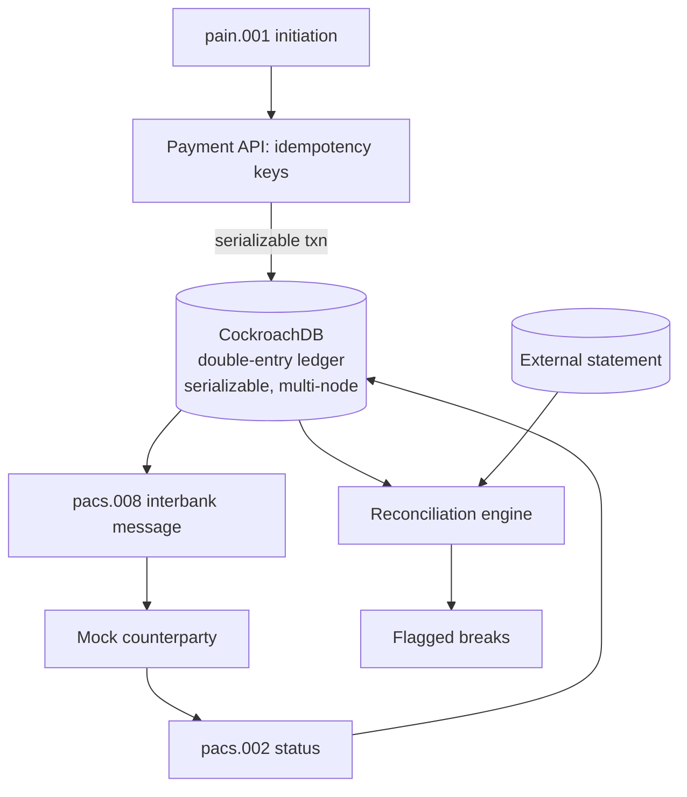

# Payments & Ledger Engine

> Moving money is the one place fintech cannot be "mostly right" — yet teams build ledgers that double-spend, drift, or fall over when a node dies, and discover it in production where the errors are irreversible. **Payments & Ledger Engine is a money-movement core you can trust:** a distributed double-entry ledger on CockroachDB where `∑debits = ∑credits` always holds — under concurrency, and even when a database node dies — with ISO 20022 processing and reconciliation on top.
>
> *Under the hood: an append-only double-entry ledger on a multi-node CockroachDB cluster (serializable by default), idempotency keys for exactly-once payments, ISO 20022 (`pain.001` → `pacs.008` → `pacs.002`).*

**For:** payments-platform engineers who need to build on a correct ledger, not debug one.
**Skill signal:** Payments · distributed systems · correctness & concurrency
**Region anchor:** EU (SEPA Instant) · UK (Faster Payments) · US (FedNow) — all ISO 20022

> ℹ️ Originally scaffolded as `data-clean-room-for-credit-scoring`; renamed to `payments-ledger-engine`. GitHub auto-redirects the old URL.

---

## Why this exists

Moving money is the one place fintech cannot be "mostly right." A ledger must never double-spend, never drift, and must behave correctly when a request arrives twice, two requests arrive at once, or a database node fails mid-transaction. This project builds that core: an immutable double-entry ledger where `∑debits = ∑credits` always holds, backed by a distributed SQL store that is serializable by default and survives node loss.

## Architecture

## Stack

- **Go** — strong concurrency story, dominant in payments infrastructure
- **CockroachDB** — distributed SQL ledger; serializable isolation by default, survives node/region loss
- **ISO 20022** XML message processing (`pain.001` → `pacs.008` → `pacs.002`)
- **Docker Compose** — multi-node Cockroach cluster + API

## What makes it stand out

- **Provable correctness** — the `∑debits = ∑credits` invariant is enforced in code and asserted under load.
- **Survives node loss** — the headline failure demo: **kill a Cockroach node mid-load-test and the invariant still holds**, no double-spend, no committed entries lost.
- **Exactly-once** under duplicate and concurrent payments via idempotency keys + serializable transactions.

See [`docs/product/brief.md`](./docs/product/brief.md) for the product thinking (users, success metrics, non-goals, risks), [`PLAN.md`](./PLAN.md) for the build plan, and [`docs/adr/`](./docs/adr/) for engineering decisions.

## Status

📋 Planning phase — specification and build plan committed. Implementation to follow.
