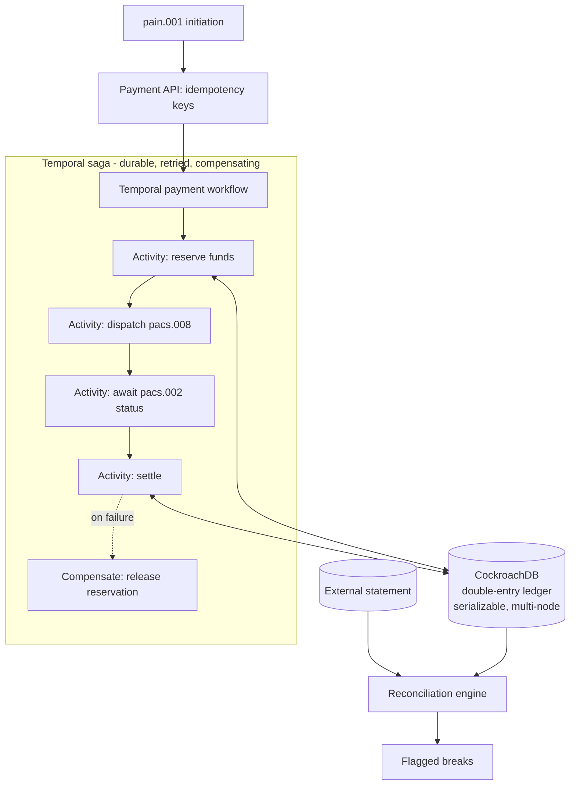

# Payments & Ledger Engine

> A correct, idempotent, crash-safe payments core: a **distributed double-entry ledger on CockroachDB** for durable, serializable *state*, and a **Temporal-orchestrated payment saga** for durable, compensating *orchestration* — with ISO 20022 messaging and reconciliation on top.

**Skill signal:** Payments · distributed systems · correctness & concurrency · durable execution
**Region anchor:** EU (SEPA Instant) · UK (Faster Payments) · US (FedNow) — all ISO 20022

> ℹ️ **Repo rename pending.** Originally scaffolded as `data-clean-room-for-credit-scoring`. Rename to **`payments-ledger-engine`** in GitHub settings — GitHub auto-redirects the old URL.

---

## Why this exists

Moving money is the one place fintech cannot be "mostly right." A payment system must never double-spend, never drift, and must behave correctly when a request arrives twice, two requests arrive at once, or a process dies halfway through a multi-step transfer. This project splits that problem into its two honest halves:

- **Durable state** — an immutable double-entry ledger where `∑debits = ∑credits` always holds, even when a database node fails. Handled by **CockroachDB** (serializable by default, survives node loss).
- **Durable orchestration** — a payment is a multi-step saga (reserve → dispatch → await status → settle, or compensate on failure) that must survive worker crashes and resume exactly where it left off. Handled by **Temporal**.

These are deliberately separate concerns: Cockroach guarantees the *data* is correct; Temporal guarantees the *process* is correct. Together they cover "move money reliably" end to end.

## Architecture

## Stack

- **Go** — strong concurrency story, dominant in payments infrastructure
- **CockroachDB** — distributed SQL ledger; serializable isolation by default, survives node/region loss
- **Temporal** — durable execution for the payment saga (retries, timers, compensation)
- **ISO 20022** XML message processing (`pain.001` → `pacs.008` → `pacs.002`)
- **Docker Compose** — Cockroach cluster + Temporal server + workers + API

## What makes it stand out

- **Provable state correctness** — the `∑debits = ∑credits` invariant is enforced in code and asserted under load; **kill a Cockroach node mid-test and the invariant still holds**.
- **Provable process correctness** — **kill a Temporal worker mid-payment and the saga resumes exactly where it left off**; a forced downstream failure triggers automatic compensation (no orphaned reservation).
- **Exactly-once** under duplicate and concurrent payments via idempotency keys + serializable transactions.
- Clean separation of concerns: state durability (Cockroach) vs. orchestration durability (Temporal) — articulated in the ADRs.

See [`PLAN.md`](./PLAN.md) for the build plan and [`docs/adr/`](./docs/adr/) for engineering decisions.

## Status

📋 Planning phase — specification and build plan committed. Implementation to follow.
